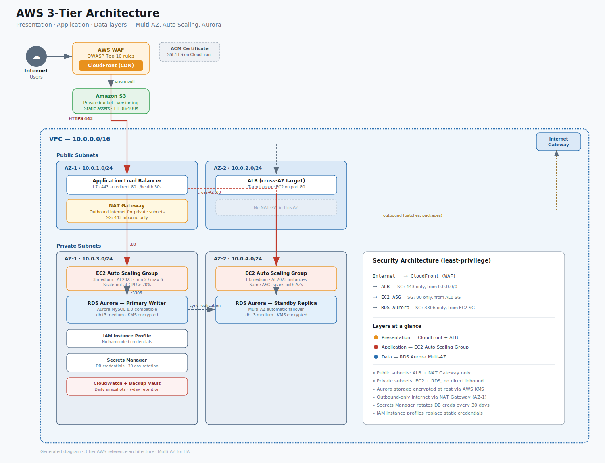

# 🏗️ AWS Web Re-Architecture Project


---

## 📌 Project Overview

This project demonstrates the **re-architecture of a web application** on **Amazon Web Services (AWS)**, migrating from a traditional monolithic/on-premises setup to a scalable, secure, and cost-optimized cloud-native infrastructure.

The goal was to improve **performance**, **availability**, **security**, and **reduce operational costs** by leveraging modern AWS services.

---

## 🏛️ Architecture Diagram



> 📁 See the [`architecture/`](./architecture/) folder for full-resolution diagram and notes.

---

## 🔄 Before vs After

| Component       | Before (Old)            | After (Re-Architected)         |
|----------------|--------------------------|-------------------------------|
| **Hosting**     | On-Premises / Single VM  | AWS EC2 with Auto Scaling     |
| **Load Balancer** | None / Hardware LB     | AWS Application Load Balancer |
| **Database**    | Single MySQL Server      | Amazon RDS Aurora (Multi-AZ)  |
| **Storage**     | Local File System        | Amazon S3 + CloudFront CDN    |
| **Networking**  | Flat Network             | VPC with Public/Private Subnets |
| **Security**    | Basic Firewall           | Security Groups + IAM + WAF   |
| **Monitoring**  | Manual Checks            | CloudWatch + SNS Alerts       |
| **Deployment**  | Manual FTP Upload        | CI/CD via GitHub Actions      |

---

## ☁️ AWS Services Used

| Category       | Service                          | Purpose                                 |
|---------------|----------------------------------|-----------------------------------------|
| **Compute**    | EC2, Auto Scaling Group          | Host the web application                |
| **Networking** | VPC, Subnets, Route Tables       | Isolated and secure network             |
| **Load Balancing** | Application Load Balancer (ALB) | Distribute traffic across instances   |
| **Database**   | Amazon RDS (Aurora MySQL)        | Managed relational database (Multi-AZ) |
| **Storage**    | Amazon S3                        | Static assets and file storage          |
| **CDN**        | Amazon CloudFront                | Global content delivery                 |
| **DNS**        | Amazon Route 53                  | Domain management and routing           |
| **Security**   | IAM, Security Groups, WAF        | Access control and threat protection    |
| **Monitoring** | CloudWatch, SNS                  | Logs, metrics, and alerts               |
| **Secrets**    | AWS Secrets Manager              | Secure credential management            |

---

## 📈 Key Improvements & Results

- ✅ **High Availability** — Multi-AZ deployment with failover support
- ✅ **Auto Scaling** — Handles traffic spikes automatically
- ✅ **Cost Optimized** — ~40% reduction in infrastructure cost
- ✅ **Secure** — WAF, Security Groups, IAM least-privilege
- ✅ **Fast** — CloudFront CDN reduces global latency
- ✅ **Observable** — Real-time monitoring with CloudWatch dashboards

---

## 📁 Project Structure

```
aws-re-architecture/
├── README.md                    # Project overview (you are here)
├── .gitignore                   # Files excluded from git
├── LICENSE                      # Project license
│
├── architecture/
│   ├── aws-architecture-diagram.png   # Main architecture diagram
│   └── architecture-notes.md          # Detailed architecture explanation
│
├── docs/
│   ├── migration-steps.md       # Step-by-step migration guide
│   └── cost-analysis.md         # Cost comparison breakdown
│
├── infrastructure/
│   ├── main.tf                  # Terraform main config
│   ├── variables.tf             # Input variables
│   ├── outputs.tf               # Output values
│   └── terraform.tfvars.example # Example variable values (safe to share)
│
└── scripts/
    ├── deploy.sh                # Deployment automation script
    └── setup.sh                 # Initial environment setup script
```

---

## 🚀 How to Deploy

### Prerequisites
- AWS CLI configured (`aws configure`)
- Terraform v1.5+ installed
- An AWS account with appropriate IAM permissions

### Step 1 — Clone the Repo
```bash
git clone https://github.com/your-username/aws-re-architecture.git
cd aws-re-architecture
```

### Step 2 — Configure Variables
```bash
cp infrastructure/terraform.tfvars.example infrastructure/terraform.tfvars
# Edit terraform.tfvars with your values
```

### Step 3 — Initialize & Deploy Infrastructure
```bash
cd infrastructure
terraform init
terraform plan
terraform apply
```

### Step 4 — Run Setup Script
```bash
chmod +x scripts/setup.sh
./scripts/setup.sh
```

---

## 🔐 Security Notes

- **No credentials are stored** in this repository
- All secrets are managed via **AWS Secrets Manager**
- IAM roles follow the **principle of least privilege**
- `.env` and `*.pem` files are excluded via `.gitignore`

---

## 📄 Documentation

| Document | Description |
|---|---|
| [Architecture Notes](./architecture/architecture-notes.md) | Detailed explanation of each component |
| [Migration Steps](./docs/migration-steps.md) | How the migration was executed |
| [Cost Analysis](./docs/cost-analysis.md) | Before vs after cost comparison |

---

## 👤 Author

**Your Name**  
Cloud / DevOps Engineer  
[](https://github.com/your-username)
[](https://linkedin.com/in/your-profile)

---

## 📜 License

This project is licensed under the MIT License — see the [LICENSE](LICENSE) file for details.
